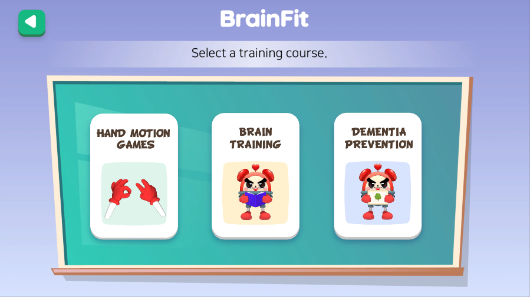
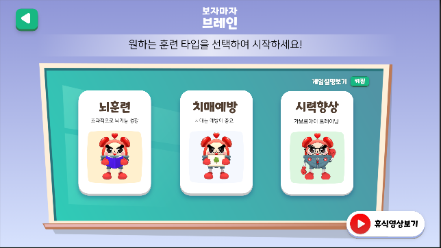
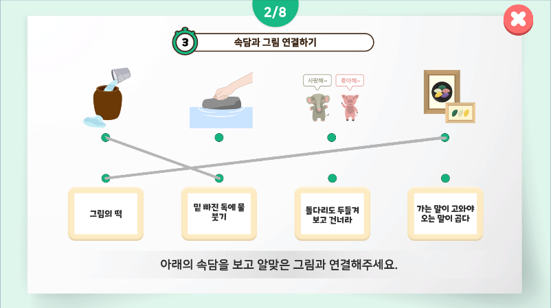
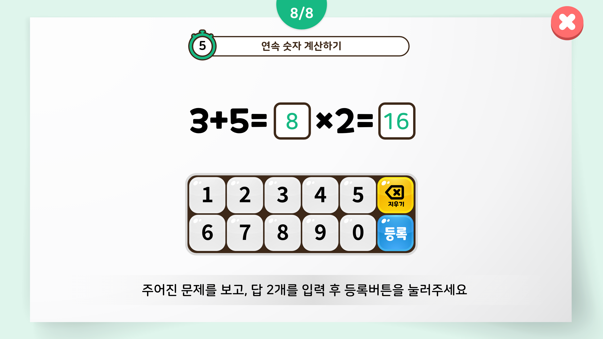
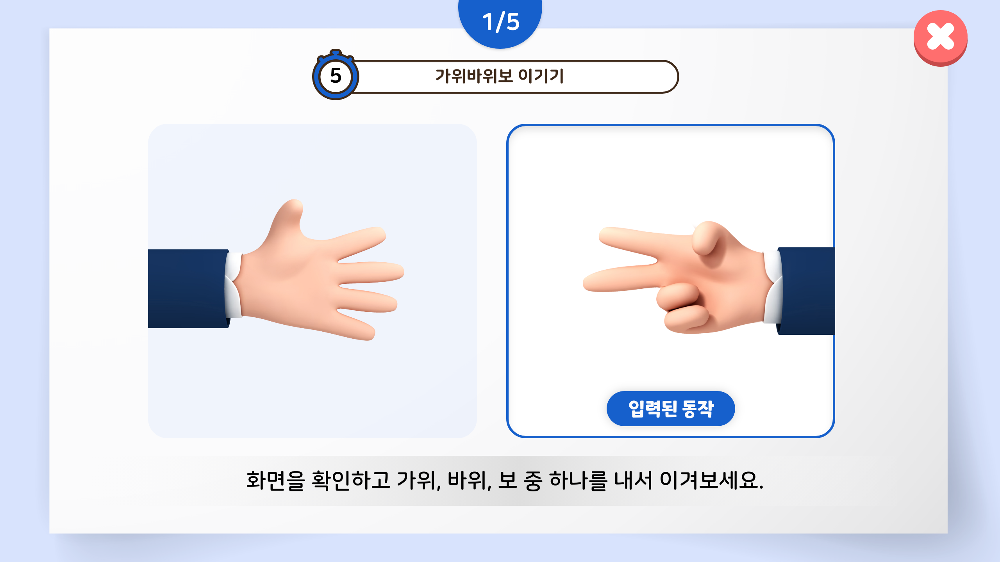
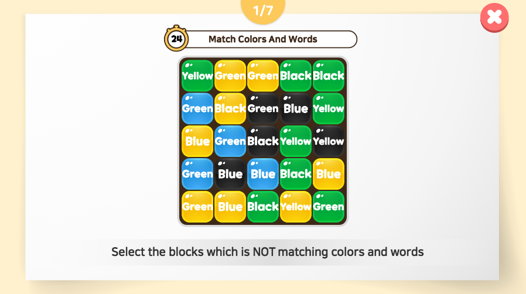
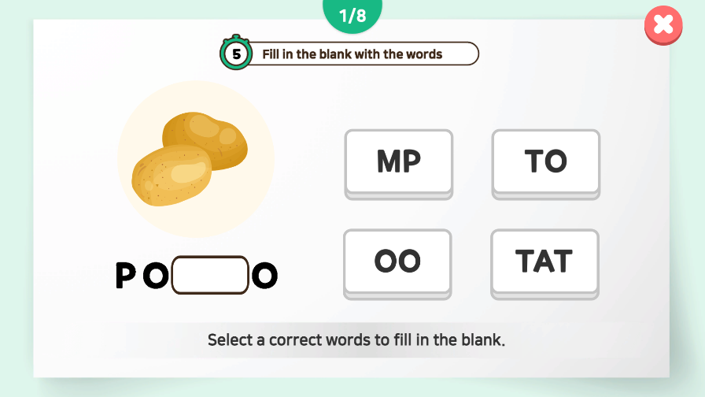
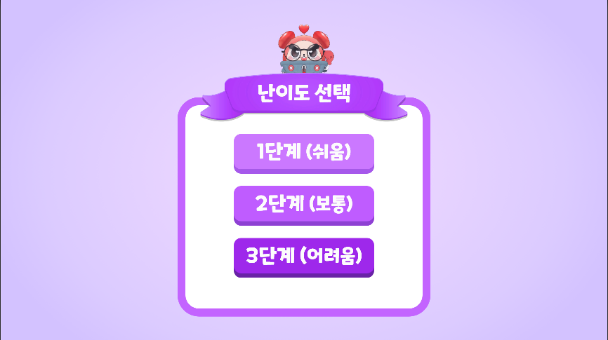
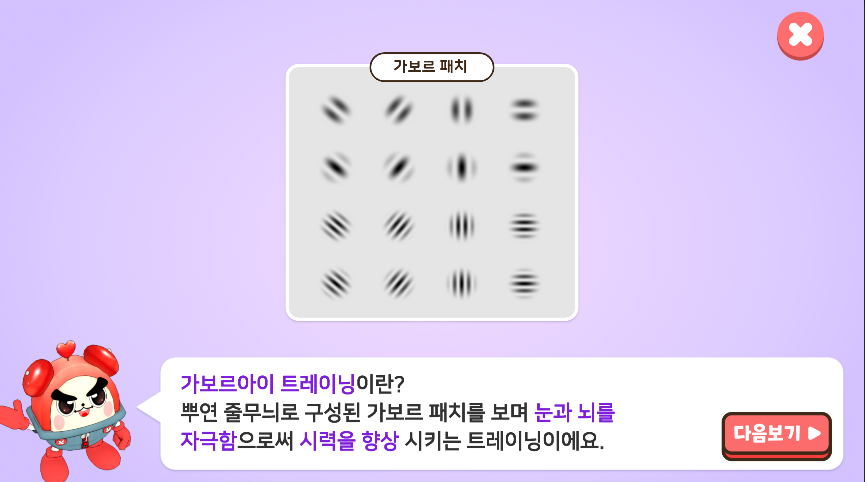
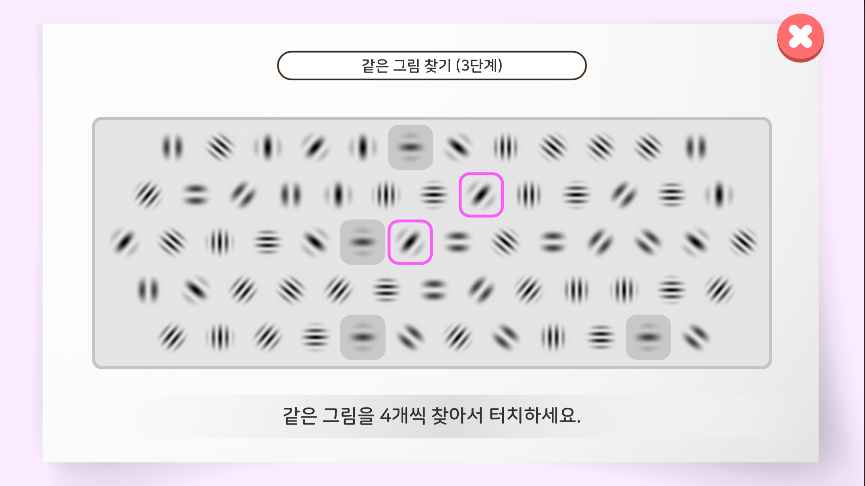

# 🧠 보자마자 브레인 (BOJAMAJA BRAIN)

인지력 향상 및 치매 예방을 위한 시니어 대상 인터랙티브 드래그 앤 드롭 콘텐츠입니다. Unity 기반으로 제작되어 있으며 Leap Motion 및 안면 인식 시스템을 활용하여 몰입감 있는 사용자 경험을 제공합니다.

---

## 프로젝트 개요

* **프로젝트명**: 보자마자 브레인 / 라이트 / M / ENG
* **개발 기간**: 2022.06 \~ 2023.03 (10개월)
* **플랫폼**: Windows (PC), Android (모바일), Mini PC (Lite 버전)
* **기술 스택**:

  * `Unity3D`
  * `C#`
  * `Leap Motion SDK`
  * `OpenCV (Face Recognition)`
  * `Android Build Support`

---

## 프로젝트 구조 정보

### 주요 CSV 데이터

* `ProverbList.csv`, `CalculationList.csv`, `ColorList.csv`, `FourWordList.csv`, `ObjectList.csv` 등 각 게임의 문제 프리셋 데이터로 사용

### English\_ver 디렉토리

#### 공통 시스템 스크립트

* `GameAppManager.cs`, `FinishManager.cs`, `BreakTimeUIManager.cs`
* `CSVReader.cs`, `CSVFile.cs` 등 텍스트 및 데이터 로드 관리 기능

#### Leap Motion 손동작 게임

* `GestureManager.cs`, `LeftHandSelect.cs`, `RightHandSelect.cs`
* `FlagUpChecker.cs`, `FlagDownChecker.cs`, `FlagCenterChecker.cs`

#### Touch 게임

* `Touch/Touch_TextBoldChange.cs`, `Touch_TimerManager.cs`
* `DementiaGameX_UIManager.cs`, `BrainGameX_DataManager.cs`

#### 체조

* `Gymnastics/Gymnasics_UIManager.cs`
  

## 🔍 주요 기술 세부 설명

### 🎮 Unity3D 기반 모듈화 구조

* **다중 플랫폼 대응**: PC/Android용 플랫폼 분기 및 기능 선택 처리 (예: 안면 인식, 체조 제거)
* **씬 기반 콘텐츠 분리**: 각 게임 단위로 씬을 분리해 독립적 설계, 공통 매니저 스크립트를 통해 전체 흐름 제어
* **매니저 패턴 사용**: `GameAppManager`, `FinishManager`, `BreakTimeUIManager` 등 핵심 관리 클래스 사용

---

### 📋 CSV 기반 콘텐츠 구성 시스템

* **문제 프리셋 외부화**: `ProverbList.csv`, `CalculationList.csv` 등 다양한 퀴즈 및 게임 문제를 CSV로 저장
* **다국어 대응 용이**: 텍스트 데이터를 외부화함으로써 영문화 및 버전별 텍스트 교체가 빠르게 가능
* **파싱 스크립트**:

  ```csharp
  string[][] csvData = CSVReader.Read("ColorList.csv");
  foreach (string[] line in csvData)
  {
      // 문제 및 선택지 로딩 처리
  }
  ```

---

### ✋ Leap Motion 손 제스처 인식

* **핸드 모델링 및 판별**: Leap SDK를 기반으로 실제 손 움직임을 추적하고 엄지/검지/소지 인식을 통해 제스처 판단
* **게임별 제스처 분기 처리**:

  * `GestureManager.cs`: 현재 게임 상황에 따라 허용된 손동작만 판별
  * `LeftHandSelect.cs`, `RightHandSelect.cs`: 양손 각각의 트리거 처리 분리

  ```csharp
  if (hand.Fingers[1].IsExtended && hand.Fingers[2].IsExtended)
  {
      // 두 손가락 인식 → 가위 판단
  }
  ```

---

### 👁 OpenCV 기반 얼굴 인식 (Windows용)

* **사용자 로그인 및 자동 스케줄 분기**:

  * OpenCV + Unity interop을 통해 얼굴 이미지 매칭
  * 특정 인물일 경우 해당 맞춤 게임 흐름으로 자동 진입

* **활용 예시**: 사용자별 `PlayerPrefs` 또는 SQLite에 정보 저장 후 로그인 시 자동 불러오기

---

### 📱 플랫폼 차등화 및 기능 대응

| 버전          | 차별 요소                             |
| ----------- | --------------------------------- |
| **ENG**     | 텍스트, 버튼, 튜토리얼 등 전체 영문화            |
| **Lite**    | Leap Motion, 체조 기능 제거 / 성능 최적화    |
| **Android** | 일부 기능 제외 / 모바일 입력 대응 (터치 입력 only) |

* **공통 처리 방식**:

  ```csharp
  #if UNITY_ANDROID
    // 모바일 버전에서 특정 기능 비활성화
  #endif
  ```

---

### 🔁 게임 공통 흐름 관리

* `GameAppManager.cs`에서 모드 선택, 게임 진입, 종료 후 분기 등 통합 관리
* `FinishManager.cs`: 각 게임 종료 시점에 점수 집계 및 리포트 표출

---

### ⏱ 타이머 및 휴식 시스템

* `Touch_TimerManager.cs`: 게임 제한 시간 및 남은 시간 표시
* `BreakTimeUIManager.cs`: 게임 간 휴식 시간 관리 (설정 시간 동안 휴식 애니메이션 제공)

---

### 🎨 UI/UX

* **드래그 앤 드롭**:

  * UI 인터랙션 기반 콘텐츠 다수 (예: 단어 조합, 사물 연결 등)
  * `EventTrigger` 또는 커스텀 `DragHandler`를 통해 조작 구현

* **튜토리얼 토글 / 설정 기능**:

  * `PlayerPrefs`를 이용한 튜토리얼 ON/OFF 및 설정값 저장

  ```csharp
  bool tutorialOn = PlayerPrefs.GetInt("Tutorial", 1) == 1;
  ```

---

### 🎯 예외처리 및 다중 게임 구조

* 각 게임은 다음 구조를 공통으로 따름:

  ```
  데이터 로딩 → 문제 셋업 → 입력 처리 → 피드백 → 점수 계산 → 종료 처리
  ```
* 각 게임 디렉토리 내에 `*_UIManager.cs`, `*_DataManager.cs` 등이 존재하여 재사용 구조를 갖춤

---

### 💾 로컬 저장 및 점수 기록

* **PlayerPrefs**로 간단한 기록 (총점, 별점 등) 저장
* 향후 SQLite 연동 또는 서버 기록 연동이 용이하도록 인터페이스 분리 가능

---

## 🧪 빌드 및 실행

### 1. 개발 환경

* Unity Version: `2021.3.x LTS` 또는 `2022.3.x LTS`
* Android Build Support / Windows Standalone 지원
* Leap Motion SDK (v4 이상 권장)

### 2. 실행 방법

#### ▶ PC (Windows)

1. Unity 에디터에서 프로젝트 열기
2. `Scenes/Main.unity` 실행
3. `Build Settings > Platform: PC, Mac & Linux` 선택 후 Build

#### ▶ Android

1. `Player Settings > Android`로 전환
2. 안면 인식 / Leap 관련 기능 제거된 버전 사용
3. APK 빌드 후 모바일 디바이스 설치

---

## 🔧 버전별 차이

| 버전             | 특징                        | 이미지 |
| -------------- | ------------------------- | ------------------------- |
| **기본**         | Leap Motion + 안면 인식 전체 포함. PC 환경에서 모든 기능을 체험할 수 있는 풀 버전으로, 가장 완전한 기능을 제공 |  |
| **LITE**       | Leap Motion 제거, 미니PC 최적화. 제스처 인식 없이 키보드·마우스 입력 기반으로 동작하며, 저사양 PC 환경에 적합 |  |
| **ENG**        | 영문화 버전, 개정된 게임 구조. UI와 텍스트가 영어로 제공되며, 해외 사용자 대상 테스트 및 교육용으로 사용 |  |
| **M(Android)** | 모바일 최적화, 체조 콘텐츠 제거. 안드로이드 기기에서 실행 가능하며 터치 UI에 맞게 조정. 가벼운 실행 환경 제공 |  |


---

## 👨‍💼 기여 내용

* 전체 게임 시스템 및 UI 구조 설계
* 콘텐츠별 씬 구성 및 게임 로직 구현
* 손 인식 입력 처리 및 제스처 기반 UX 적용
* 영문화 적용을 위한 텍스트 시스템 개선
* 사용자 튜토리얼 / 휴식 기능 추가

---
## 게임 목록 정리

| 카테고리 | 게임 이름 | 설명 | 이미지 |
|----------|-----------|------|--------|
| 뇌훈련 게임 | 표에서 단어 찾기 | 글자 표에서 단어를 찾아 클릭하는 게임 |  |
| 뇌훈련 게임 | 음식값 계산하기 | 주어진 메뉴와 가격으로 계산하는 게임 |  |
| 뇌훈련 게임 | 숫자판 순서대로 터치하기 | 숫자를 작은 것부터 순서대로 터치 |  |
| 뇌훈련 게임 | 단어 색깔 맞추기 | 글자와 색이 일치하는지 판단 |  |
| 뇌훈련 게임 | 반전된 글자 맞추기 | 거꾸로 쓰인 글자를 맞추는 게임 |  |
| 뇌훈련 게임 | 거울 시계 시간 맞추기 | 반전된 시계 시간을 맞추는 게임 |  |
| 치매예방 게임 | 속담-그림 맞추기 | 속담과 어울리는 그림을 연결 |  |
| 치매예방 게임 | 글자 채워 단어 완성 | 빈칸에 글자를 넣어 단어 완성 |  |
| 치매예방 게임 | 미로 찾기 | 출발점에서 도착점까지 길 찾기 |  |
| 치매예방 게임 | 연속 숫자 계산 | 규칙에 맞는 연속 숫자 계산하기 |  |
| Leap Motion 손게임 | 가위바위보 | 손동작 인식으로 승패 결정 |  |
| Leap Motion 손게임 | 청기백기 | 지시에 맞게 손을 들어 올리기 |  |
| Leap Motion 손게임 | 손가락 셈하기 | 손가락 개수를 인식해 숫자 맞추기 |  |

### ENG 버전 콘텐츠 예시
| 카테고리 | 게임 이름 | 설명 | 이미지 |
|----------|-----------|------|--------|
| 메뉴 화면 | BrainFit 메인 선택 | 훈련 코스(손동작 게임, 뇌훈련, 치매예방)를 선택하는 메인 메뉴 |  |
| 뇌훈련 게임 | Match Colors And Words (단어 색 맞추기) | 블록의 색과 글자가 일치하지 않는 것을 찾아 선택 |  |
| 치매예방 게임 | Fill in the Blank (빈칸 단어 완성) | 그림 힌트를 보고 빈칸에 들어갈 알맞은 단어 조합을 선택 |  |

### Gabor Eye Training 콘텐츠 예시
| 난이도 선택 | 가보르 아이 트레이닝 | 같은 그림 찾기 |
|----------------|-----------------------|-------------|
|  |  |  |

### 전체 기능 설계 이미지


